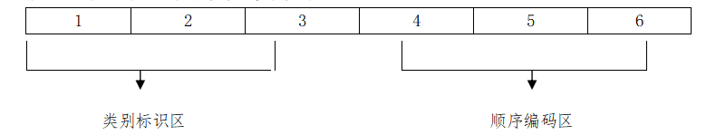

**一、证券代码定义及编码原则**

证券代码是指上海证券交易所（以下简称本所）用于证券交易及非交易业务的数字编码。本所证券代码采用6位阿拉伯数字编码，取值范围为000000-999999。6位代码的前3位为类别标识区，其中第一位为类别标识，第二位至第三位为业务标识，6位代码的后3位为顺序编码区：

**二、证券代码类别分配表**

| **首位代码** | **类别**                     |
| ------------ | ---------------------------- |
| ０           | 指数、国债                   |
| １           | 债券现券                     |
| ２           | 债券现券、债券回购、债券借贷 |
| ３           | 优先股、国债期货（已暂停）   |
| ４           | 备用                         |
| ５           | 基金、公募REITs、权证        |
| ６           | A股、存托凭证                |
| ７           | 非交易业务                   |
| ８           | 标准券、备用                 |
| ９           | B股                          |

**三、证券代码类别与业务标识分配规则**

| **第1位** | **第2-3位** | **业务标识定义**                                             | **备注**                                                     |
| --------- | ----------- | ------------------------------------------------------------ | ------------------------------------------------------------ |
| 0         | 00          | 上证指数系列、中证指数系列                                   | 其中000680-000689用于科创板相关指数                          |
| 0         | 09          | 国债                                                         | 2000年前发行                                                 |
| 0         | 10          | 国债                                                         | 2000年-2009年发行                                            |
| 0         | 18          | 政策性银行金融债                                             |                                                              |
| 0         | 19          | 国债                                                         | 2010年及以后发行                                             |
| 0         | 20          | 记账式贴现国债                                               |                                                              |
| 0         | 90          | 国债质押式回购质押券出入库                                   |                                                              |
| 0         | 91          | 国债质押式回购质押券出入库                                   | 对应019\*\*\*                                                   |
| 0         | 99          | 国债质押式回购质押券出入库                                   | 对应009\*\*\*                                                   |
| 1         | 00          | 债券回售、可转换公司债券                                     | 100000-100899用于可转换公司债券（对应600\*\*\*)，已不再增用100900-100999用于债券回售 |
| 1         | 01          | 地方政府债券                                                 |                                                              |
| 1         | 02          | 企业债券质押券出入库                                         | 对应127000-127999                                            |
| 1         | 03          | 企业债券质押券出入库                                         | 对应124000-124999                                            |
| 1         | 04          | 公司债券、企业债券质押券出入库                               | 104000-104499用于公司债券质押券出入库（对应122000-122499）104500-104999用于企业债券质押券出入库（对应122500-122999） |
| 1         | 05          | 债券质押券出入库、债券交易型开放式指数基金质押券出入库       | 105000-105699用于分离交易的可转换公司债券质押券出入库（对应126\*\*\*)105700-105799用于债券交易型开放式指数基金质押券出入库105800－105899用于可转换公司债券质押券出入库（对应110\*\*\*、113\*\*\*）105900-105999用于企业债券质押券出入库（对应120\*\*\*、129\*\*\*） |
| 1         | 06          | 地方政府债券质押券出入库                                     | 对应130\*\*\*                                                   |
| 1         | 07          | 记账式贴现国债质押券出入库                                   | 对应020\*\*\*                                                   |
| 1         | 08          | 政策性银行金融债质押券出入库                                 | 对应018\*\*\*                                                   |
| 1         | 09          | 地方政府债券                                                 |                                                              |
| 1         | 10          | 可转换公司债券                                               | 110000-110799用于上市公司公开发行可转换公司债券（对应600\*\*\*）110800-110999用于上市公司非公开发行可转换公司债券 |
| 1         | 11          | 可转换公司债券                                               | 111000-111499用于可转换公司债券（对应605\*\*\*）                |
| 1         | 12          | 资产支持证券                                                 |                                                              |
| 1         | 13          | 可转换公司债券                                               | 113000-113499用于上市公司公开发行可转换公司债券（对应601\*\*\*）113500-113999用于上市公司公开发行可转换公司债券（对应603\*\*\*） |
| 1         | 14          | 非公开发行公司债券                                           |                                                              |
| 1         | 15          | 公开发行公司债券                                             |                                                              |
| 1         | 18          | 科创板可转换公司债券                                         | 118000-118499用于科创板上市公司公开发行可转换公司债券118500-118699用于科创板上市公司非公开发行可转换公司债券 |
| 1         | 20          | 企业债券                                                     |                                                              |
| 1         | 21          | 资产支持证券                                                 |                                                              |
| 1         | 22          | 公司债券、企业债券                                           | 122000-122499用于公司债券122500-122999用于企业债券           |
| 1         | 23          | 公司债券、企业债券、资产支持证券                             | 123000-123499用于企业债券、公司债券123500-123999用于资产支持证券 |
| 1         | 24          | 企业债券                                                     |                                                              |
| 1         | 25          | 中小企业私募债券、非公开发行公司债券                         |                                                              |
| 1         | 26          | 分离交易的可转换公司债券                                     |                                                              |
| 1         | 27          | 企业债券                                                     | 其中127000-127899用于企业债券127900-127999用于政府支持债券（中国铁路建设债券专用） |
| 1         | 28          | 信贷资产支持证券                                             |                                                              |
| 1         | 29          | 企业债券                                                     |                                                              |
| 1         | 30          | 地方政府债券                                                 |                                                              |
| 1         | 31          | 资产支持证券                                                 |                                                              |
| 1         | 32          | 可交换公司债券                                               |                                                              |
| 1         | 33          | 可交换公司债券质押券出入库                                   | 对应132\*\*\*                                                   |
| 1         | 34          | 公开发行公司债券质押券出入库                                 | 对应136\*\*\*                                                   |
| 1         | 35          | 证券公司短期债、并购重组私募债券、非公开发行公司债券         |                                                              |
| 1         | 36          | 公开发行公司债券                                             |                                                              |
| 1         | 37          | 非公开发行可交换公司债券、公开发行公司债券                   | 137000-137499用于非公开发行可交换公司债券137500-137999用于公开发行公司债券 |
| 1         | 38          | 非公开发行可交换公司债券换股、公开发行公司债券               | 138000-138499用于非公开发行可交换公司债券换股，对应137000-137499138500-138999用于公开发行公司债券 |
| 1         | 39          | 企业债券                                                     |                                                              |
| 1         | 40          | 地方政府债券                                                 |                                                              |
| 1         | 41          | 地方政府债券质押券出入库                                     | 对应140\*\*\*                                                   |
| 1         | 42          | 资产支持证券                                                 |                                                              |
| 1         | 43          | 公开发行公司债券                                             |                                                              |
| 1         | 44          | 公开发行公司债券质押券出入库                                 | 对应143\*\*\*                                                   |
| 1         | 45          | 非公开发行公司债券                                           |                                                              |
| 1         | 46          | 资产支持证券                                                 |                                                              |
| 1         | 47          | 地方政府债券                                                 |                                                              |
| 1         | 48          | 地方政府债券质押券出入库                                     | 对应147\*\*\*                                                   |
| 1         | 49          | 资产支持证券                                                 |                                                              |
| 1         | 50          | 非公开发行公司债券                                           |                                                              |
| 1         | 51          | 非公开发行公司债券                                           |                                                              |
| 1         | 52          | 企业债券                                                     |                                                              |
| 1         | 53          | 企业债券质押券出入库                                         | 对应152\*\*\*                                                   |
| 1         | 54          | 公司债券质押券出入库                                         | 对应155\*\*\*                                                   |
| 1         | 55          | 公司债券                                                     |                                                              |
| 1         | 56          | 资产支持证券                                                 |                                                              |
| 1         | 57          | 地方政府债券                                                 |                                                              |
| 1         | 58          | 地方政府债券质押券出入库                                     | 对应157\*\*\*                                                   |
| 1         | 59          | 资产支持证券                                                 |                                                              |
| 1         | 60          | 地方政府债券                                                 |                                                              |
| 1         | 61          | 地方政府债券质押券出入库                                     | 对应160\*\*\*                                                   |
| 1         | 62          | 非公开发行公司债券                                           |                                                              |
| 1         | 63          | 公开发行公司债券                                             |                                                              |
| 1         | 64          | 公开发行公司债券质押券出入库                                 | 对应163\*\*\*                                                   |
| 1         | 65          | 资产支持证券                                                 |                                                              |
| 1         | 66          | 非公开发行公司债券                                           |                                                              |
| 1         | 67          | 非公开发行公司债券                                           |                                                              |
| 1         | 68          | 资产支持证券                                                 |                                                              |
| 1         | 69          | 资产支持证券                                                 |                                                              |
| 1         | 70          | 信用保护工具                                                 | 170000-170499用于信用保护凭证170900-170999用于组合型信用保护合约 |
| 1         | 71          | 地方政府债券                                                 |                                                              |
| 1         | 72          | 地方政府债券质押券出入库                                     | 对应171\*\*\*                                                   |
| 1         | 73          | 地方政府债券                                                 |                                                              |
| 1         | 74          | 地方政府债券质押券出入库                                     | 对应173\*\*\*                                                   |
| 1         | 75          | 公开发行公司债券                                             |                                                              |
| 1         | 76          | 公开发行公司债券质押券出入库                                 | 对应175\*\*\*                                                   |
| 1         | 77          | 非公开发行公司债券                                           |                                                              |
| 1         | 78          | 非公开发行公司债券                                           |                                                              |
| 1         | 79          | 资产支持证券                                                 |                                                              |
| 1         | 80          | 资产支持证券                                                 |                                                              |
| 1         | 81          | 可转换公司债券转股                                           | 对应600\*\*\*，已不再增用                                       |
| 1         | 82          | 债券回售、非公开发行公司债券                                 | 182000-182299用于债券回售182300-182999用于非公开发行公司债券 |
| 1         | 83          | 资产支持证券                                                 |                                                              |
| 1         | 84          | 企业债券                                                     | 其中184000-184799用于企业债券184800-184999用于政府支持债券（中国铁路建设债券专用） |
| 1         | 85          | 公开发行公司债券                                             |                                                              |
| 1         | 86          | 地方政府债券                                                 |                                                              |
| 1         | 87          | 公开发行公司债券质押券出入库                                 | 对应188\*\*\*                                                   |
| 1         | 88          | 公开发行公司债券                                             |                                                              |
| 1         | 89          | 资产支持证券                                                 |                                                              |
| 1         | 90          | 可转换公司债券转股                                           | 对应600\*\*\*                                                   |
| 1         | 91          | 可转换公司债券转股                                           | 191000－191499对应601\*\*\*191500－191999对应603\*\*\*             |
| 1         | 92          | 可交换公司债券换股                                           | 对应132\*\*\*                                                   |
| 1         | 93          | 创新创业公司非公开发行可转换公司债券转股                     | 193000-193099用于创新创业公司非公开发行可转换公司债券转股，对应145900-145999193100-193999用于资产支持证券 |
| 1         | 94          | 非公开发行公司债券                                           |                                                              |
| 1         | 95          | 可转换公司债券转股                                           | 195000-195499用于可转债转股，对应605\*\*\*                      |
| 1         | 96          | 非公开发行公司债券                                           |                                                              |
| 1         | 97          | 非公开发行公司债券                                           |                                                              |
| 1         | 98          | 地方政府债券                                                 |                                                              |
| 1         | 99          | 资产支持证券                                                 |                                                              |
| 2         | 01          | 国债回购                                                     | 席位托管方式                                                 |
| 2         | 02          | 企业债回购                                                   | 席位托管方式                                                 |
| 2         | 03          | 国债买断式回购                                               |                                                              |
| 2         | 04          | 债券质押式回购                                               | 账户托管方式                                                 |
| 2         | 05          | 质押式报价回购                                               |                                                              |
| 2         | 06          | 债券质押式协议回购                                           |                                                              |
| 2         | 07          | 债券质押式三方回购                                           |                                                              |
| 2         | 08          | 债券借贷                                                     | 208000-208009用于债券借贷业务                                |
| 2         | 30          | 地方政府债券                                                 |                                                              |
| 2         | 31          | 地方政府债券                                                 |                                                              |
| 2         | 32          | 地方政府债券                                                 |                                                              |
| 2         | 33          | 地方政府债券                                                 |                                                              |
| 2         | 34          | 地方政府债券                                                 |                                                              |
| 2         | 35          | 地方政府债券                                                 |                                                              |
| 2         | 36          | 地方政府债券                                                 |                                                              |
| 2         | 40          | 公开发行公司债券                                             |                                                              |
| 2         | 41          | 公开发行公司债券                                             |                                                              |
| 2         | 42          | 公开发行公司债券                                             |                                                              |
| 2         | 43          | 公开发行公司债券                                             |                                                              |
| 2         | 44          | 公开发行公司债券                                             |                                                              |
| 2         | 50          | 非公开发行公司债券                                           |                                                              |
| 2         | 51          | 非公开发行公司债券                                           |                                                              |
| 2         | 52          | 非公开发行公司债券                                           |                                                              |
| 2         | 53          | 非公开发行公司债券                                           |                                                              |
| 2         | 54          | 非公开发行公司债券                                           |                                                              |
| 2         | 55          | 非公开发行公司债券                                           |                                                              |
| 2         | 56          | 非公开发行公司债券                                           |                                                              |
| 2         | 57          | 非公开发行公司债券                                           |                                                              |
| 2         | 58          | 非公开发行公司债券                                           |                                                              |
| 2         | 59          | 非公开发行公司债券                                           |                                                              |
| 2         | 60          | 资产支持证券                                                 |                                                              |
| 2         | 61          | 资产支持证券                                                 |                                                              |
| 2         | 62          | 资产支持证券                                                 |                                                              |
| 2         | 63          | 资产支持证券                                                 |                                                              |
| 2         | 64          | 资产支持证券                                                 |                                                              |
| 2         | 65          | 资产支持证券                                                 |                                                              |
| 2         | 66          | 资产支持证券                                                 |                                                              |
| 2         | 70          | 企业债券                                                     |                                                              |
| 2         | 71          | 企业债券                                                     |                                                              |
| 2         | 72          | 企业债券                                                     |                                                              |
| 2         | 80          | 非公开发行公司债券                                           |                                                              |
| 3         | 10          | 国债期货                                                     | 已暂停                                                       |
| 3         | 30          | 公开发行优先股                                               |                                                              |
| 3         | 60          | 非公开发行优先股                                             |                                                              |
| 5         | 00          | 契约型封闭式基金                                             |                                                              |
| 5         | 01          | 上市开放式基金                                               |                                                              |
| 5         | 02          | 上市开放式基金                                               |                                                              |
| 5         | 05          | 创新型封闭式证券投资基金                                     | 505800-505899用于创新型封闭式证券投资基金                    |
| 5         | 06          | 科创板相关LOF                                                | 506000-506099用于科创板相关LOF                               |
| 5         | 08          | 公募REITs                                                    | 508000-508099用于公募REITs                                   |
| 5         | 10          | 交易型开放式指数证券投资基金                                 | 标的指数为沪市指数、跨市场指数或跨境指数                     |
| 5         | 11          | 债券交易型开放式指数基金、交易型货币市场基金                 | 511000-511299用于单市场债券（沪）ETF511300-511599用于现金申赎类债券ETF511600-511999用于交易型货币基金 |
| 5         | 12          | 交易型开放式指数证券投资基金                                 | 标的指数为跨市场指数                                         |
| 5         | 13          | 交易型开放式指数证券投资基金                                 | 标的指数为跨境指数                                           |
| 5         | 15          | 交易型开放式指数证券投资基金                                 | 标的指数为跨市场指数                                         |
| 5         | 16          | 交易型开放式指数证券投资基金                                 | 标的指数为跨市场指数                                         |
| 5         | 17          | 交易型开放式指数证券投资基金                                 | 517000-517999用于跨市场股票（沪港深京）ETF                   |
| 5         | 18          | 商品交易型开放式证券投资基金                                 |                                                              |
| 5         | 19          | 开放式基金申赎                                               | 其中5198**用于实时申赎货币基金                               |
| 5         | 20          | 交易型开放式指数证券投资基金                                 | 520500-520999用于跨境ETF                                     |
| 5         | 21          | 开放式基金认购                                               | 对应519\*\*\*                                                   |
| 5         | 22          | 开放式基金跨市场转托管                                       | 对应519\*\*\*                                                   |
| 5         | 23          | 开放式基金分红                                               | 对应519\*\*\*                                                   |
| 5         | 24          | 开放式基金基金转换                                           | 对应519\*\*\*                                                   |
| 5         | 30          | 交易型开放式指数证券投资基金                                 | 标的指数为沪市指数                                           |
| 5         | 50          | 基金                                                         |                                                              |
| 5         | 51          | 交易型开放式指数证券投资基金                                 | 551000-551499用于单市场债券（沪）ETF                         |
| 5         | 60          | 交易型开放式指数证券投资基金                                 | 标的指数为跨市场指数                                         |
| 5         | 61          | 交易型开放式指数证券投资基金                                 | 标的指数为跨市场指数                                         |
| 5         | 62          | 交易型开放式指数证券投资基金                                 | 标的指数为跨市场指数                                         |
| 5         | 63          | 交易型开放式指数证券投资基金                                 | 标的指数为跨市场指数                                         |
| 5         | 80          | 权证                                                         | 含股改权证、公司权证                                         |
| 5         | 82          | 权证行权                                                     |                                                              |
| 5         | 88          | 科创板相关ETF                                                | 588000-588299用于单市场股票（科创板）ETF588300-588699用于跨市场股票（含科创板）ETF588700-588999用于单市场股票（科创板）ETF |
| 5         | 89          | 交易型开放式指数证券投资基金                                 | 589000-589999用于单市场股票（科创板）ETF                     |
| 6         | 00          | A股                                                          | 主板A股股票                                                  |
| 6         | 01          | A股                                                          | 主板A股股票                                                  |
| 6         | 03          | A股                                                          | 主板A股股票                                                  |
| 6         | 05          | A股                                                          | 主板A股股票                                                  |
| 6         | 88          | A股                                                          | 科创板股票                                                   |
| 6         | 89          | 存托凭证                                                     | 科创板存托凭证                                               |
| 7         | 00          | 配股                                                         | 对应600\*\*\*                                                   |
| 7         | 01          | 转配股                                                       |                                                              |
| 7         | 02          | 职工股配股                                                   | 对应600\*\*\*                                                   |
| 7         | 03          | 配售                                                         |                                                              |
| 7         | 04          | 可转换公司债券持股配债                                       | 对应600\*\*\*                                                   |
| 7         | 05          | 基金扩募                                                     | 不再增用                                                     |
| 7         | 06          | 要约收购、现金选择权                                         | 706000-706599用于主板上市公司要约收购、现金选择权706600-706999用于科创板上市公司要约收购、现金选择权 |
| 7         | 07          | 网上按市值申购或增发                                         | 对应605\*\*\*                                                   |
| 7         | 08          | 网上按市值申购或增发配号                                     | 对应605\*\*\*                                                   |
| 7         | 09          | 按市值配售配股                                               | 不再增用                                                     |
| 7         | 13          | 可转换公司债券申购                                           | 对应605\*\*\*                                                   |
| 7         | 14          | 可转换公司债券申购配号                                       | 对应605\*\*\*                                                   |
| 7         | 15          | 可转换公司债券持股配债                                       | 对应605\*\*\*                                                   |
| 7         | 16          | 增发款                                                       | 对应605\*\*\*                                                   |
| 7         | 17          | 配股                                                         | 对应605\*\*\*                                                   |
| 7         | 18          | 科创板可转债申购                                             | 对应118000-118499                                            |
| 7         | 19          | 科创板可转债申购配号                                         | 对应118000-118499                                            |
| 7         | 26          | 科创板可转债配债                                             | 对应118000-118499                                            |
| 7         | 30          | 网上按市值申购或增发                                         | 对应600\*\*\*                                                   |
| 7         | 31          | 持股增发                                                     | 对应600\*\*\*                                                   |
| 7         | 32          | 网上按市值申购或增发                                         | 对应603\*\*\*                                                   |
| 7         | 33          | 可转换公司债券申购                                           | 对应600\*\*\*                                                   |
| 7         | 34          | 增发款                                                       | 对应603\*\*\*                                                   |
| 7         | 35          | 基金申购                                                     | 不再增用                                                     |
| 7         | 36          | 网上按市值申购或增发配号                                     | 对应603\*\*\*                                                   |
| 7         | 37          | 按市值配售                                                   | 不再增用                                                     |
| 7         | 38          | 网络投票                                                     | 对应600\*\*\*，由于技术调整不再增用                             |
| 7         | 39          | 按市值配售申购                                               | 不再增用                                                     |
| 7         | 40          | 增发款                                                       | 对应600\*\*\*                                                   |
| 7         | 41          | 网上按市值申购或增发配号                                     | 对应600\*\*\*                                                   |
| 7         | 42          | 配股                                                         | 对应603\*\*\*                                                   |
| 7         | 43          | 可转换公司债券申购款                                         | 对应600\*\*\*                                                   |
| 7         | 44          | 可转换公司债券配号                                           | 对应600\*\*\*                                                   |
| 7         | 45          | 基金申购款                                                   | 不再增用                                                     |
| 7         | 46          | 基金申购配号                                                 | 不再增用                                                     |
| 7         | 47          | 按市值配售                                                   | 不再增用                                                     |
| 7         | 48          | 按市值配售                                                   | 不再增用                                                     |
| 7         | 49          | 按市值配售配号                                               | 不再增用                                                     |
| 7         | 50          | 国债承销发行                                                 |                                                              |
| 7         | 51          | 国债预发行及债券分销                                         | 751000-751199用于国债分销；751200-751399用于政策性银行金融债券分销；751400-751599用于地方政府债券网上分销；751600-751799用于国债分销；751800-751809用于利率招标国债预发行交易；751810-751819用于价格招标国债预发行交易；751900-751969用于地方政府债券网上分销；751970-751999用于公司债券及企业债分销；751850-751899用于面向专业投资者公开发行公司债券网上分销 |
| 7         | 52          | 网络投票                                                     | 对应603\*\*\*，由于技术调整不再增用                             |
| 7         | 53          | 可转换公司债券持股配债                                       | 对应603\*\*\*                                                   |
| 7         | 54          | 可转换公司债券申购                                           | 对应603\*\*\*                                                   |
| 7         | 55          | 可转换公司债券申购款                                         | 对应603\*\*\*                                                   |
| 7         | 56          | 可转换公司债券配号                                           | 对应603\*\*\*                                                   |
| 7         | 58          | 可交换公司债券网上发行配号                                   | 758000-758099用于可交换公司债券网上发行配号                  |
| 7         | 59          | 可交换公司债券网上发行申购                                   | 759000-759099用于可交换公司债券网上发行申购                  |
| 7         | 60          | 配股                                                         | 对应601\*\*\*                                                   |
| 7         | 62          | 职工股配股                                                   | 对应601\*\*\*                                                   |
| 7         | 64          | 可转换公司债券持股配债                                       | 对应601\*\*\*                                                   |
| 7         | 70          | 公开发行优先股申购                                           | 对应330\*\*\*                                                   |
| 7         | 71          | 公开发行优先股配股、配售                                     | 对应330\*\*\*                                                   |
| 7         | 72          | 公开发行优先股申购款                                         | 对应330\*\*\*                                                   |
| 7         | 73          | 公开发行优先股申购配号                                       | 对应330\*\*\*                                                   |
| 7         | 80          | 网上按市值申购或增发                                         | 对应601\*\*\*                                                   |
| 7         | 81          | 持股增发                                                     | 对应601\*\*\*                                                   |
| 7         | 83          | 可转换公司债券申购                                           | 对应601\*\*\*                                                   |
| 7         | 85          | 科创板股票配股                                               | 对应688\*\*\*                                                   |
| 7         | 86          | 科创板上市公司股东以配售方式减持股份业务（简称科创板配售业务） | 786000-786899用于科创板股票配售786900-786999用于科创板存托凭证配售 |
| 7         | 87          | 科创板股票网上申购                                           | 对应688\*\*\*                                                   |
| 7         | 88          | 网络投票                                                     | 对应601\*\*\*，由于技术调整不再增用                             |
| 7         | 89          | 科创板股票网上申购配号                                       | 对应688\*\*\*                                                   |
| 7         | 90          | 增发款                                                       | 对应601\*\*\*                                                   |
| 7         | 91          | 网上按市值申购或增发配号                                     | 对应601\*\*\*                                                   |
| 7         | 93          | 可转换公司债券申购款                                         | 对应601\*\*\*                                                   |
| 7         | 94          | 可转换公司债券配号                                           | 对应601\*\*\*                                                   |
| 7         | 95          | 科创板存托凭证网上申购                                       | 对应689\*\*\*                                                   |
| 7         | 96          | 科创板存托凭证网上申购配号                                   | 对应689\*\*\*                                                   |
| 7         | 99          | 指定交易、融资融券、网络投票密码服务、资金前端控制、身份认证 | （一）指定交易相关证券代码799999：指定交易；799998：撤销指定；799997：回购指定；799996：回购指定撤销（二）融资融券相关证券代码799981：余券划转；799982：还券划转；799983：担保物划转；799984：券源划转；799993：用于证券金融公司转融通申报结束提醒（三）网络投票密码服务相关证券代码799988：A股网络投票密码服务（四）资金前端控制相关证券代码799970：用于资金前端控制自设额度应急调整（五）身份认证相关证券代码799991：用于通过交易报盘方式为投资者办理中国结算网络服务身份认证 |
| 8         | 88          | 标准券                                                       | 888880代码为新标准券，用于债券回购转换成标准券               |
| 9         | 00          | B股                                                          |                                                              |
| 9         | 01          | B转H                                                         | 901000-901099用于上海市场B股上市公司境内上市外资股转换上市地以介绍方式在香港联合交易所有限公司主板上市及挂牌交易，即B转H |
| 9         | 38          | 网络投票                                                     | 对应B股，由于技术调整不再增用                                |
| 9         | 39          | 密码服务                                                     | 939988用于B股网络投票密码服务                                |
| 9         | 70          | B股配股权证                                                  |                                                              |

**四、附则**

本所可以根据具体情况调整代码分配指南。

 

 

 

 